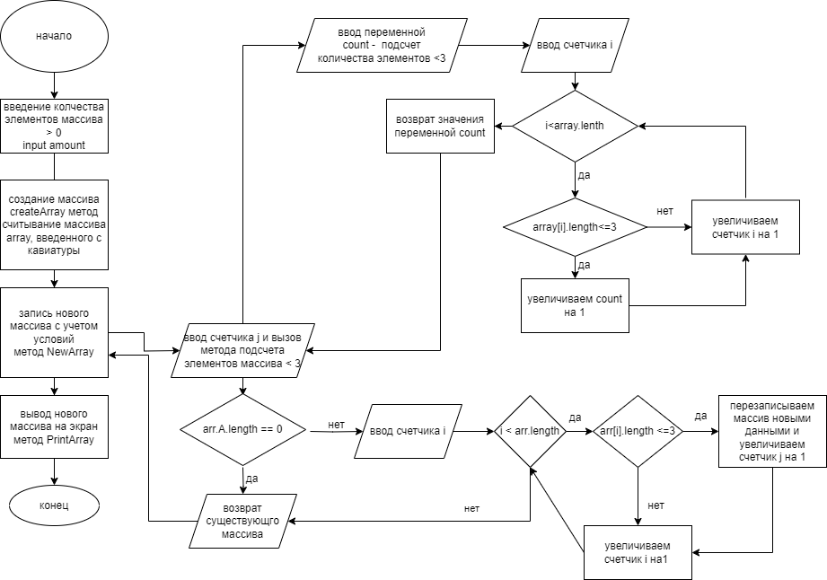

решение программы

1. запросить пользователя ввести количество элементов массива больше 0. используется метод promot вывода сообщения и считывания информации с консоли и перевода его в численное значение
2. вывод сообщения пользователю с запросом ввода элементов массива
3. создание массива сreateArray метод считывание массива array, введенного с кавиатуры
4. запись нового массива с учетом условий метод NewArray
5. вывод нового массива на экран метод PrintArray