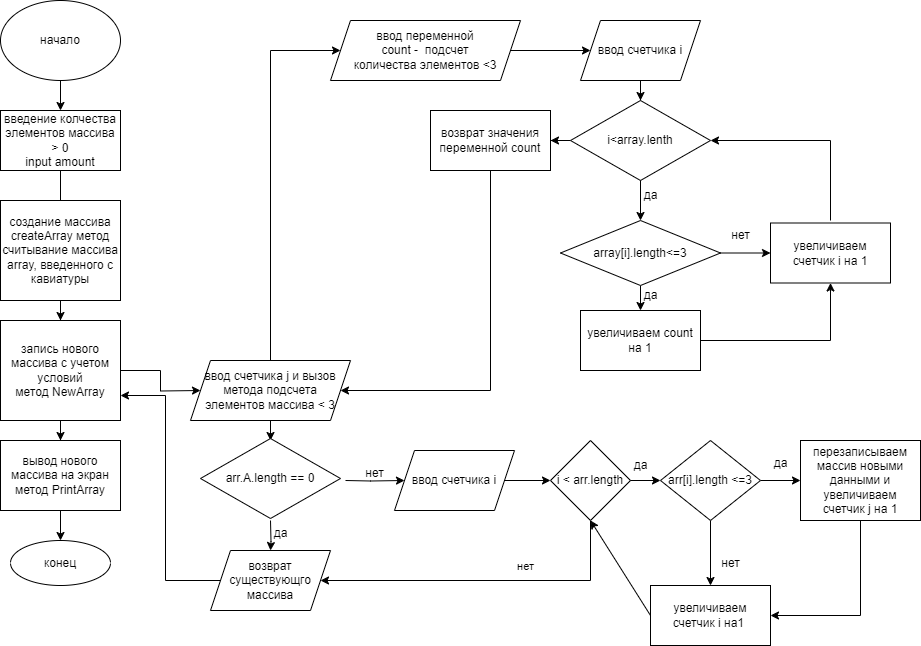

# Итоговая контрольная работа по основному блоку

## Задача
Написать программу, которая из имеющегося массива строк формирует новый массив из строк, длина которых меньше, либо равна 3 символам. Первоначальный массив можно ввести с клавиатуры, либо задать на старте выполнения алгоритма. При решении не рекомендуется пользоваться коллекциями, лучше обойтись исключительно массивами.

## Решение задачи

1. Запросить пользователя ввести количество элементов массива больше 0. используется метод prompt вывода сообщения и считывания информации с консоли и перевода его в численное значение. переменной number присваивается значение количества элементов.
2. Вывод сообщения пользователю с запросом ввода элементов массива
3. Создание массива. метод сreateArray считывание данных, введенных пользователем с кавиатуры и запись их в новый массив
4. Запись нового массива с учетом условий метод NewArray и метод СountElement
5. Вывод нового массива на экран метод PrintArray

## Описание методов

### Метод Prompt
Вывод сообщения и считывания информации с консоли и перевода его в численное значение. На вход принимает значение строки, на выводе дает числовое значение типа int.

### CreateArray
Cчитывание данных, введенных пользователем с кавиатуры и запись их в новый массив. На вход принимает переменную number, колчество элементов массива. При помощи цикла for пользователь вводит каждый новый элемент массива, которые будут в составе нового массива; цикл завершается когда счетчик будет равен переменной number. Метод возвращает массив.

### PrintArray
Вывод массива на экран. 
На вход методу подается массив. Выводим открывающую скобку. При помощи цикла for проходимся по всему массиву и проверяем, если элемент не последний, то печатаем элемент с запятой и пробелом, если последни, то без всего. По завершении цикла выводим на экран закрывающую скобку.

### Метод CountElement 
Подсчет элементов массива, содержащий меньше 3 символов. На вход принимается массив, вводим переменную count для подсчета количества элементов меньше 3х символов, далее при помощи цикла for проходимся по всему массиву и проверяем каждый его элемент на соответсвие заданному условию. При соответствии условию переменая count увеличивается на 1. На выходе метод возвращает переменую count.

### NewArray
Запись нового массива с учетом условий, выполняемых методом CountElement
На вход принимается массив. Создаем счетчик j. Создаем новый массив, вызовая метода **[CountElement](#countelement)**. При помощи условия if проверяем длинну нового массива. Если равна 0, то возвращаем пустой массив, если нет, то при помощи цикла for проходимся по всему массиву и проверяем каждый элемент на количество символов. Если количесиво символов <3, то записываем этот элемент в новый массив. На выходе метод возвращает новый массив.
